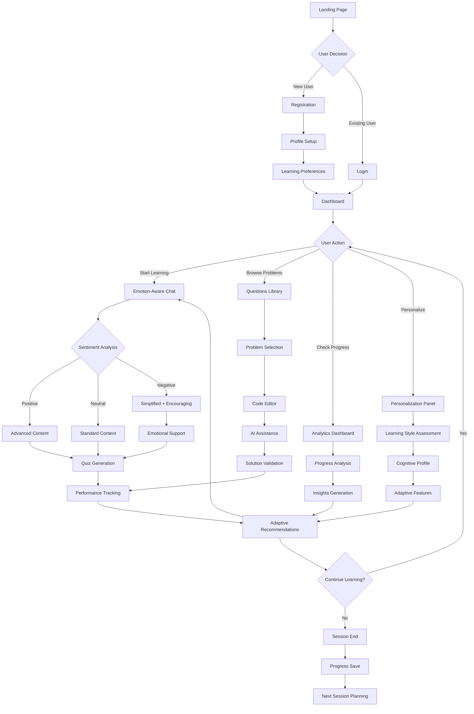

# DSA-GPT User Journey Map

## 🗺️ **Complete User Journey Flow**



## 🎯 **Detailed User Journey Stages**

### **Stage 1: Discovery & Onboarding** 🚀

#### **1.1 Landing Page Experience**
```
┌─────────────────────────────────────────────────────────────┐
│                    First Impression                         │
├─────────────────────────────────────────────────────────────┤
│  🎯 What Users See:                                          │
│  • Hero message: "Master DSA with AI-Powered Tutoring"      │
│  • Key benefits: Emotion-aware, personalized, 24/7 AI       │
│  • Social proof: 30+ problems, 3 languages, research-backed │
│  • Clear CTAs: "Get Started Free" and "Sign In"             │
│                                                             │
│  🧠 User Psychology:                                         │
│  • Problem recognition: "I struggle with DSA"               │
│  • Solution awareness: "AI can help me learn"               │
│  • Trust building: Research paper, technical credibility    │
│  • Action motivation: Free access, immediate value          │
└─────────────────────────────────────────────────────────────┘
```

#### **1.2 Registration Flow**
```
┌─────────────────────────────────────────────────────────────┐
│                    Account Creation                         │
├─────────────────────────────────────────────────────────────┤
│  📝 Information Collection:                                  │
│  • Minimal friction: Name, email, password                  │
│  • Learning context: Language preference, DSA level         │
│  • Future personalization: Learning style hints             │
│                                                             │
│  🎯 User Experience Goals:                                   │
│  • Quick setup: < 2 minutes                                 │
│  • Clear value proposition: Immediate access to AI tutor    │
│  • Personalization promise: "We'll adapt to your style"     │
│  • Success confirmation: Welcome message + first session    │
└─────────────────────────────────────────────────────────────┘
```

### **Stage 2: First Learning Experience** 🎓

#### **2.1 Dashboard Introduction**
```
┌─────────────────────────────────────────────────────────────┐
│                    Welcome Dashboard                        │
├─────────────────────────────────────────────────────────────┤
│  🎯 Onboarding Elements:                                     │
│  • Welcome message with user's name                         │
│  • Quick tour of key features                               │
│  • Suggested first action: "Start chatting with AI tutor"   │
│  • Progress indicators: Empty states with potential         │
│                                                             │
│  🧠 User Guidance:                                           │
│  • Clear navigation: Chat, Questions, Analytics             │
│  • Feature discovery: Tooltips and help text                │
│  • Success indicators: What good progress looks like        │
│  • Next steps: Recommended learning path                    │
└─────────────────────────────────────────────────────────────┘
```

#### **2.2 First AI Interaction**
```
┌─────────────────────────────────────────────────────────────┐
│                    AI Tutor Introduction                    │
├─────────────────────────────────────────────────────────────┤
│  🤖 Initial Experience:                                      │
│  • Warm welcome: "Hi [Name]! I'm your DSA tutor"            │
│  • Context awareness: "I know you're a [level] in [language]"│
│  • Engagement question: "What would you like to learn today?"│
│  • Guidance offer: "I can help with concepts or problems"   │
│                                                             │
│  🎯 Emotional Intelligence:                                  │
│  • Sentiment detection: Analyzing user's first message      │
│  • Adaptive tone: Friendly, encouraging, supportive         │
│  • Confidence building: "Everyone starts somewhere"         │
│  • Progress tracking: First interaction logged              │
└─────────────────────────────────────────────────────────────┘
```

### **Stage 3: Core Learning Journey** 📚

#### **3.1 Adaptive Learning Flow**
```
┌─────────────────────────────────────────────────────────────┐
│                    Learning Adaptation                      │
├─────────────────────────────────────────────────────────────┤
│  🔄 Continuous Adaptation:                                   │
│  • Real-time sentiment analysis of every message            │
│  • Dynamic response generation based on emotional state     │
│  • Difficulty adjustment based on performance               │
│  • Topic selection based on learning gaps                   │
│                                                             │
│  🎯 Personalization Triggers:                                │
│  • Frustration detected → Simplified explanations           │
│  • Confidence shown → Advanced challenges                   │
│  • Confusion patterns → Visual aids and examples            │
│  • Success streaks → Spaced repetition scheduling           │
└─────────────────────────────────────────────────────────────┘
```

#### **3.2 Problem-Solving Experience**
```
┌─────────────────────────────────────────────────────────────┐
│                    Problem-Solving Journey                  │
├─────────────────────────────────────────────────────────────┤
│  📋 Problem Selection:                                       │
│  • Browse by difficulty: Matches user's current level       │
│  • Filter by language: User's preferred language            │
│  • Topic organization: Logical progression                   │
│  • Progress indicators: Completed vs. attempted             │
│                                                             │
│  💻 Solution Development:                                    │
│  • Code editor: Syntax highlighting, auto-completion        │
│  • AI assistance: Context-aware help and hints              │
│  • Error handling: Real-time feedback and suggestions       │
│  • Solution validation: Test cases and correctness checks   │
│                                                             │
│  🎯 Learning Reinforcement:                                  │
│  • Explanation requests: "Why does this work?"              │
│  • Alternative approaches: "Can I solve this differently?"  │
│  • Related concepts: "What's similar to this?"              │
│  • Practice opportunities: "Try this variation"             │
└─────────────────────────────────────────────────────────────┘
```

### **Stage 4: Advanced Features** 🚀

#### **4.1 Analytics & Insights**
```
┌─────────────────────────────────────────────────────────────┐
│                    Progress Analytics                       │
├─────────────────────────────────────────────────────────────┤
│  📊 Performance Tracking:                                    │
│  • Learning velocity: How fast user is progressing          │
│  • Topic mastery: Which concepts are understood             │
│  • Weak areas: Where user needs more practice               │
│  • Time analysis: When user learns best                     │
│                                                             │
│  😊 Emotional Intelligence:                                  │
│  • Sentiment trends: Emotional journey over time            │
│  • Frustration patterns: When user struggles most           │
│  • Confidence building: Progress in self-efficacy           │
│  • Engagement metrics: Session length and frequency         │
│                                                             │
│  🎯 Actionable Insights:                                     │
│  • Personalized recommendations: "Focus on recursion"       │
│  • Study schedule: Optimal timing for reviews               │
│  • Learning style optimization: Visual vs. textual          │
│  • Goal setting: Realistic progress targets                 │
└─────────────────────────────────────────────────────────────┘
```

#### **4.2 Personalization Deep Dive**
```
┌─────────────────────────────────────────────────────────────┐
│                    Advanced Personalization                 │
├─────────────────────────────────────────────────────────────┤
│  🧠 Learning Style Assessment:                               │
│  • Visual learners: Diagrams, flowcharts, animations        │
│  • Auditory learners: Verbal explanations, discussions      │
│  • Kinesthetic learners: Interactive examples, hands-on     │
│  • Reading learners: Detailed text, step-by-step guides     │
│                                                             │
│  🧩 Cognitive Profile:                                       │
│  • Working memory: How much information user can hold       │
│  • Processing speed: How quickly user can think             │
│  • Attention span: How long user can focus                  │
│  • Pattern recognition: How well user sees connections      │
│                                                             │
│  🎯 Adaptive Features:                                       │
│  • Content pacing: Faster or slower explanations            │
│  • Complexity adjustment: More or less detail               │
│  • Interaction style: More or less guidance                 │
│  • Review frequency: Spaced repetition timing               │
└─────────────────────────────────────────────────────────────┘
```

## 🎯 **Key User Journey Touchpoints**

### **Emotional Journey Mapping**
```
┌─────────────────────────────────────────────────────────────┐
│                    Emotional Progression                    │
├─────────────────────────────────────────────────────────────┤
│  😰 Initial State:                                           │
│  • Anxiety: "DSA is hard, I don't know where to start"      │
│  • Overwhelm: "Too many concepts, too little time"          │
│  • Doubt: "Can I really learn this?"                        │
│                                                             │
│  😐 Early Engagement:                                         │
│  • Curiosity: "This AI tutor seems helpful"                 │
│  • Relief: "Finally, someone who explains things clearly"   │
│  • Hope: "Maybe I can actually learn this"                  │
│                                                             │
│  😊 Growing Confidence:                                       │
│  • Excitement: "I'm actually understanding this!"           │
│  • Motivation: "I want to learn more"                       │
│  • Pride: "I solved that problem myself"                    │
│                                                             │
│  🚀 Mastery Development:                                      │
│  • Confidence: "I can tackle any DSA problem"               │
│  • Independence: "I can learn new concepts on my own"       │
│  • Achievement: "I've mastered this topic"                  │
└─────────────────────────────────────────────────────────────┘
```

### **Success Metrics by Journey Stage**
```
┌─────────────────────────────────────────────────────────────┐
│                    Success Indicators                       │
├─────────────────────────────────────────────────────────────┤
│  📈 Discovery Stage:                                         │
│  • Landing page conversion: 15-25%                          │
│  • Registration completion: 80-90%                          │
│  • Time to first session: < 5 minutes                       │
│                                                             │
│  🎓 Learning Stage:                                          │
│  • Session completion rate: 85-95%                          │
│  • Return rate: 70-80% within 7 days                        │
│  • Confidence improvement: 2.4 → 4.1/5                      │
│                                                             │
│  🚀 Mastery Stage:                                           │
│  • Problem-solving success: 80-90%                          │
│  • Quiz accuracy: 4.2/5 average                             │
│  • Self-directed learning: 60-70%                           │
│                                                             │
│  🏆 Advanced Stage:                                          │
│  • Topic mastery: 70-80% of curriculum                      │
│  • Teaching others: 20-30% of users                         │
│  • Long-term retention: 6+ months                           │
└─────────────────────────────────────────────────────────────┘
```

## 🎯 **User Journey Optimization**

### **Pain Point Resolution**
- **Initial Overwhelm**: Guided onboarding and clear value proposition
- **Learning Plateaus**: Adaptive difficulty and emotional support
- **Time Management**: Spaced repetition and personalized scheduling
- **Concept Confusion**: Multiple explanation styles and visual aids
- **Motivation Drops**: Progress tracking and achievement recognition

### **Engagement Strategies**
- **Gamification**: Progress badges, streaks, and achievements
- **Social Learning**: Peer comparisons and community features
- **Personalization**: Tailored content and learning paths
- **Immediate Feedback**: Real-time responses and validation
- **Progress Visualization**: Clear charts and success indicators

---

**This user journey map ensures that every interaction with DSA-GPT is designed to support the user's learning goals while maintaining emotional engagement and motivation.** 